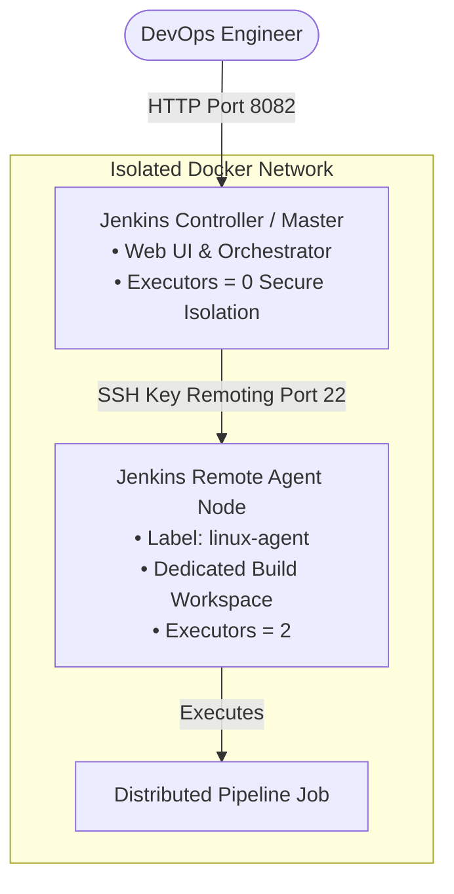

# CodeAlpha DevOps Internship - Task 2: Jenkins Remoting Project 🏗️⚙️

[](https://www.jenkins.io/)
[](https://www.docker.com/)
[](https://www.openssh.com/)
[](https://plugins.jenkins.io/configuration-as-code/)

---

## 📌 Project Overview
This project implements a **Distributed Jenkins Master-Agent Architecture** utilizing **SSH Remoting** to distribute build workloads across isolated worker nodes securely. The entire infrastructure is automated declaratively using **Jenkins Configuration as Code (JCasC)** and **Docker Compose**.

### 🎯 Key Objectives Achieved:
- [x] **Jenkins Remoting Setup**: Secure communication between Jenkins Controller (Master) and Remote Agent (Worker) over SSH.
- [x] **Distributed Build Execution**: Workloads dispatched exclusively to worker nodes based on labels (`linux-agent`).
- [x] **Node Isolation & Security**: Controller configured with `numExecutors: 0` to prevent executing builds on the master node, eliminating attack vectors on the orchestrator.
- [x] **Jenkins Configuration as Code (JCasC)**: Zero-touch setup; Jenkins boots with pre-configured credentials, nodes, security realms, and pipeline jobs automatically.
- [x] **Multi-Stage Pipeline (`Jenkinsfile`)**: Demonstrates node architecture verification, workload execution, and workspace isolation.

---

## 🏗️ Architecture Diagram



---

## 📁 Project Structure

```text
CodeAlpha_JenkinsRemoting/
├── docker-compose.yml           # Multi-node cluster orchestration
├── jenkins-controller/
│   ├── Dockerfile               # Controller with pre-installed plugins & JCasC
│   ├── plugins.txt              # Required Jenkins plugins list
│   └── casc.yaml                # Declarative setup (Security, Nodes, Credentials, Jobs)
├── jenkins-agent/
│   └── Dockerfile               # SSH-enabled Remote Worker Node with OpenJDK 17
├── keys/
│   ├── id_ed25519               # SSH Private Key for Jenkins Controller
│   └── id_ed25519.pub           # SSH Public Key authorized on Remote Agent
├── pipelines/
│   └── Jenkinsfile              # Distributed Pipeline definition
├── manage.ps1                   # Automation & CLI helper for PowerShell
├── manage.sh                    # Helper script for Linux/macOS
└── README.md                    # Project documentation & Video guide
```

---

## 🚀 Quick Start Guide

### Prerequisites
- [Docker Desktop](https://www.docker.com/products/docker-desktop/) installed and running.

### 1. Start the Jenkins Cluster
```powershell
docker compose up -d --build
```
*Or using the PowerShell helper script:*
```powershell
.\manage.ps1 start
```

### 2. Access Jenkins Web UI
- Open browser: **[http://localhost:8082](http://localhost:8082)**
- **Username:** `admin`
- **Password:** `admin`

---

## 🔍 Verifying Remote Node Connection

1. In Jenkins Web UI, navigate to **Manage Jenkins** ➔ **Nodes** (or directly [http://localhost:8082/manage/computer/](http://localhost:8082/manage/computer/)).
2. You will see:
   - **Built-In Node (Master):** Shows `0 Executors` (Master isolation).
   - **remote-linux-agent:** Shows `In service` / `Online` with `2 Executors` connected over SSH Remoting.

---

## 🧪 Running the Distributed Pipeline

A distributed pipeline job named **`CodeAlpha-Distributed-Build-Job`** is created automatically.

### Option A: From Web UI
1. Click on **CodeAlpha-Distributed-Build-Job** on the Jenkins home page.
2. Click **Build Now**.
3. Inspect the **Console Output** to observe the job executing remotely on `remote-linux-agent`.

### Option B: From Terminal / Script
```powershell
.\manage.ps1 trigger-job
```

---

## 🛡️ DevOps Security Best Practices Applied

1. **Master Node Isolation (`numExecutors: 0`)**: Prevents untrusted build scripts from gaining access to Jenkins Controller credentials or filesystem.
2. **Ed25519 Cryptographic Keys**: Uses modern high-security Ed25519 SSH keys for Controller-to-Agent remoting.
3. **Configuration as Code (JCasC)**: All infrastructure is defined in version control (`casc.yaml`), eliminating manual configuration errors.
4. **Dedicated Network Isolation**: Controller and Agent communicate inside an isolated internal Docker bridge network.

---

## 📹 LinkedIn Video Demonstration Outline
1. **Introduction**: Introduce Task 2 (Jenkins Remoting Project) for **@CodeAlpha**.
2. **Architecture**: Explain the Master/Agent distributed architecture and why master isolation (`0 executors`) is crucial in enterprise DevOps.
3. **Live Demonstration**:
   - Show the Jenkins Nodes page ([http://localhost:8082/manage/computer/](http://localhost:8082/manage/computer/)) highlighting the connected `remote-linux-agent`.
   - Run the pipeline **CodeAlpha-Distributed-Build-Job**.
   - Show the Console Output displaying the agent hostname and remote execution logs.
4. **Conclusion**: Recap the benefits of Jenkins Remoting (scalability, security isolation, multi-platform builds).

---

## 👤 Author
- **Intern Name:** CodeAlpha Intern
- **Internship Program:** CodeAlpha DevOps Internship
- **Task:** Task 2 - Jenkins Remoting Project
